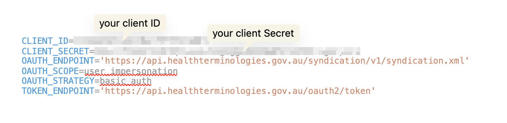

### How to build the environment for this script
   *  In your development/scripts folder 
   * ```git clone https://github.com/mjosborne1/fhir-pack```
   * ```cd fhir-pack```
   * ```pip install -r requirements.txt```
   * ```pip install fhirclient```   (In case it doesn't install from the requirements file)
   * ```virtualenv env```
   * ```source env/bin/activate```
   * open the fhirpack folder in your development environment (IDE) of choice e.g. VS Code 
   * in the root folder of fhir-pack , copy or rename .env-example to a new file called ```.env```


### Get your client credentials for NCTS
   1. Log into https://www.healthterminologies.gov.au/
   1. Click on `Clients`
   1. If you have system client credentials, copy / paste these to the ```.env``` file in the root fhir-pack folder
   

### Download the FHIR IG Packages
  * these packages are referenced so that only the bound ValueSets and CCodeSystems of interest are downloaded.
  1. download AU Base, AU Core, AU eREquesting and AU Provider Directory to os.environ['HOME']/data/npm/{the package} e.g. hl7.fhir.au.base@4.2.0-preview/node_modules  
  e.g.
  ```
  cd ~/data/npm
  npm --registry https://packages.simplifier.net install hl7.fhir.au.core@0.3.0-ballot
  ```
  1. change the ig.json config to point at those locations
  ```
   {
        "name" : "hl7.fhir.au.base",
        "version" : "4.2.0-preview",
        "title" : "AU Base Implementation Guide",
        "folder" : "/Users/YOUR-USER-ID/data/npm/hl7.fhir.au.base@4.2.0-preview/node_modules"
    },
  ```
  * Improvement required - auto download of fhir npm packages. I have downloaded AU Base to os.environ['HOME']/data/npm/hl7.fhir.au.base@4.2.0-preview/node_modules and AU Core to os.environ['HOME']/data/npm/hl7.fhir.au.core@0.3.0-ballot/node_modules

### Run the script
   * open a cmd prompt in the fhir-pack folder
   * `python main.py`
   * Some defaults are set that may not work for you so check the arguments by running `python main.py --help`
```
usage: main.py [-h] [-o OUTDIR] [-t TMPDIR] [-p PACKAGE_NAME] [-v PACKAGE_VERSION] [-r RELEASE]

optional arguments:
  -h, --help            show this help message and exit
  -o OUTDIR, --outdir OUTDIR
                        ouput root dir for npm packages
  -t TMPDIR, --tmpdir TMPDIR
                        tmp dir for downloaded bundles
  -p PACKAGE_NAME, --package_name PACKAGE_NAME
                        npm package name
  -v PACKAGE_VERSION, --package_version PACKAGE_VERSION
                        npm package version   x.y.z
  -r RELEASE, --release RELEASE
                        NCTS release version  YYYYMMDD or the word "current" for most recent version
```

Examples:
On windows: 
```
python main.py -o "C:\DATA\npm"  -t "C:\TEMP\fhir-pack" -p "healthterminologies.gov.au" -v "4.0.1" -r "20240331"
```

On Mac / Linux:
```
python main.py -o "~/data/npm" -t "/tmp/fhir-pack" -p "healthterminologies.gov.au" -v "4.0.1" -r "20240331"
```

### Output - Node Modules
Creates a folder structure in outdir
 *  Level 1: healthterminologies.gov.au@4.0.1
 *  Level 2: node_modules/  package.json ( dependencies: "healthterminologies.gov.au" )
 *  Level 3: inside node_modules/ a folder called "healthterminologies.gov.au"
 *  Level 4: inside healthterminologies.gov.au/ go all the resources in json files